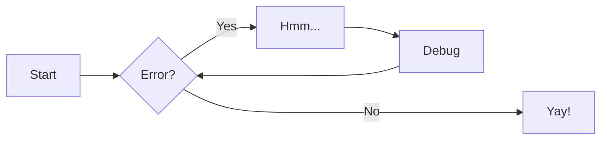

# Subpage 2

This sub-page can be used to elaborate on a specific part of the component.

## Details

It is linked off the main page, and due to its inclusion in the `mkdocs.yml` file,
becomes part of the auto-generated site navigation.

## MkDocs

Visit https://www.mkdocs.org for more information about the MkDocs tool.

